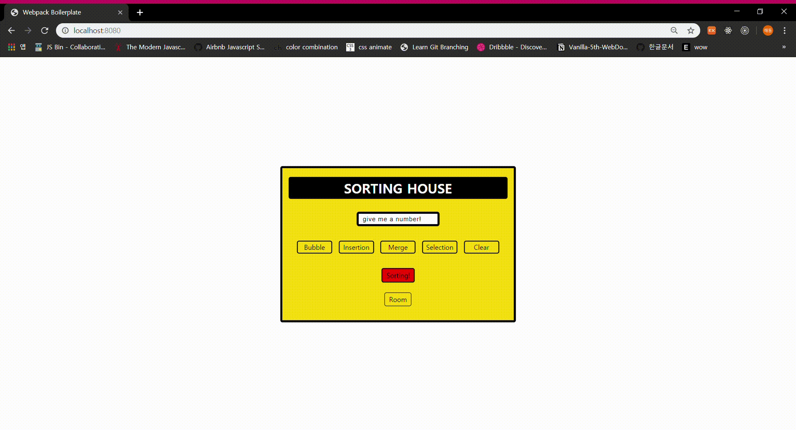

# Vanilla Sorting

4가지 정렬 알고리즘의 구동 방식을 웹으로 표현해내는 과제입니다.



## Setup

Install dependencies

```sh
$ yarn install (or npm install)
```

## Development

```sh
$ yarn dev (or npm run dev)
# visit http://localhost:8080
```

## Feature (Bubble, Insertion, Merge, Selection)

4가지 정렬 알고리즘의 구동 방식을 시각적으로 확인할 수 있도록 표현해야 합니다. 그리고 아래의 조건이 충족되어야 합니다.

* 사용자가 "숫자"들을 최소 5개에서 최대 10개까지 선택할 수 있는 UI가 있습니다.
* 숫자들을 입력한 후, 사용자가 원하는 정렬 방식을 선택할 수 있습니다.
* 정렬 방식을 선택한 후, 실행할 수 있는 "실행" 버튼이 있습니다.
* 실행시킬 경우, 시각적으로 해당 정렬 로직이 어떤 식으로 작동되는지 보여줍니다..
* 숫자의 갯수가 충족되지 않았거나, 정렬 방식이 선택되지 않은 상황에서는 "실행"이 되지 않습니다..
* 숫자가 아닌 값은 받을 수 없습니다.

## Challenges and Things to do

* Quick sort도 여유로울 때 해보자!
* 각 정렬 알고리즘의 시간복잡도에 대해서 공부해야 한다.
* Divide and Conquer 란?
